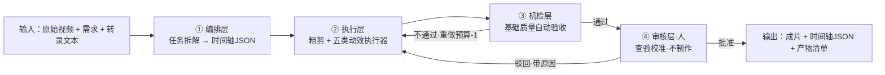

# AI 视频剪辑工作流 Agent · 四层架构详细搭建 v0.1

> 状态：架构定稿（2026-09-30）｜配套参考：motion-reel（Daily-AC/motion-reel）
> 一句话定位：一个**人在回路的半闭合**视频剪辑 Agent —— 编排层拆任务、内核跑循环、执行层用工具、机检层保基础质量、审核层由人校准（人不制作，只查验）。

---

## 0. 架构总览（定稿）



**四层职责一句话**

| 层 | 一句话 | 谁做 |
|---|---|---|
| ① 编排层 | 把"做出成片"拆成步骤序列，输出唯一契约产物：时间轴 JSON | AI（LLM + 规则） |
| ② 执行层 | 按事件调对应模块干活，吐产物 + 元数据 | 多执行器（自建 + 现成工具） |
| ③ 机检层 | 只查"硬"指标：没做错（锚点/时长/一致性/编码） | AI（规则 + 工具校验，不做审美判断） |
| ④ 审核层 | 只判"做得好不好"：批准 / 驳回 / 改参数 | 人 |

**关键术语**

| 术语 | 定义 |
|---|---|
| 事件（event） | 时间轴 JSON 里一个最小动效单元，五类：overlay / card / diagram / illustration / anim |
| 语义组（group） | 一个讲解要点 = 一组事件（示例图 + 圈选 + 关键词卡），共享锚点/主题 |
| 时间轴 JSON | 编排层唯一输出，全流程契约；一切执行器、机检、人审都围绕它 |
| 执行器（executor） | 吃事件、吐产物+元数据的模块；统一接口，可替换 |
| 重做预算 | 每个事件允许重做的次数上限，耗尽则上报人工接管 |
| 内核 | 驱动全流程的状态机循环 |

---

## 1. 内核：工作循环状态机

### 1.1 状态定义

| 状态 | 含义 | 进入条件 |
|---|---|---|
| `pending` | 待拆解 | 新任务进入 |
| `planned` | 拆解完成 | 编排层产出时间轴 JSON |
| `executing` | 执行中 | 有事件被调度 |
| `checking` | 机检中 | 执行层回吐产物 |
| `redoing` | 重做中 | 机检不通过 / 人审驳回 |
| `reviewing` | 人审中 | 机检全过 |
| `done` | 完成 | 人审批准 |
| `stuck` | 卡死上报 | 重做预算耗尽 |

### 1.2 转移表

| 当前状态 | 事件 | 下一状态 |
|---|---|---|
| pending | 编排完成 | planned |
| planned | 调度事件 | executing |
| executing | 产物回吐 | checking |
| checking | 全部通过 | reviewing |
| checking | 存在失败（预算未耗尽） | redoing |
| checking | 失败且预算耗尽 | stuck |
| redoing | 重做完成 | checking |
| reviewing | 人批准 | done |
| reviewing | 人驳回（预算未耗尽） | redoing |
| reviewing | 人驳回（预算耗尽） | stuck |

### 1.3 两条硬规则

1. **重做预算**：每个事件默认 **3 次**（可配置）。预算耗尽 → `stuck`，将该事件标为"人工接管"，其余事件照常推进，不阻塞全片。
2. **异步回填**：生成型事件（illustration / anim）耗时高，事件先以 `pending` 占位在时间轴上，生成完成回填为 `ready`，合成在最后统一跑。编排层必须支持"占位 → 回填"两阶段。

---

## 2. 编排层（任务拆解）

### 2.1 输入 / 输出

- 输入：原始视频（实拍/录屏）+ 用户需求（时长/风格/受众）+ 转录文本（ASR 输出，带时间戳）
- 输出：**一份 `timeline.json`** + 步骤状态报告

### 2.2 步骤序列（一个任务的内部阶段）

1. **粗剪**：调用粗剪执行器（现成转录驱动剪辑工具或 AI 剪辑），产出剪辑视频 + 剪辑决策记录
2. **转录对齐**：把转录文本按句对齐到剪辑后时间轴（Whisper 风格 segments JSON）
3. **内容分析**：LLM 把内容切成"讲解要点"，每个要点 = 一个语义组（含主题、涉及的画面区域、关键句、关键词）
4. **动效事件决策**：按"信号 → 事件"规则，为每个要点生成五类事件，写入时间轴 JSON
5. **调度**：交内核执行

### 2.3 时间轴 JSON Schema v0.1

```json
{
  "version": "0.1",
  "fps": 30,
  "duration": 15.0,
  "source": {
    "video": "粗剪.mp4",
    "transcript": "transcript.json"
  },
  "groups": [
    {
      "id": "g1",
      "topic": "事件视界",
      "anchor": {"x": 0.62, "y": 0.35},
      "events": ["e01", "e02", "e03"]
    }
  ],
  "events": [
    {
      "id": "e01",
      "group": "g1",
      "type": "overlay",
      "state": "ready",
      "start": 0.0, "end": 2.2,
      "target": "circle",
      "anchor": {"x": 0.62, "y": 0.35},
      "params": {"color": "#ffd100", "label": "这就是事件视界", "fade": [0.2, 0.4]},
      "retries": 0,
      "check": {"status": "pending"}
    }
  ]
}
```

**字段表（默认值已填，可改）**

| 字段 | 说明 | 必填 |
|---|---|---|
| `id` | 事件唯一标识 | 是 |
| `group` | 所属语义组 id | 是 |
| `type` | `overlay / card / diagram / illustration / anim` | 是 |
| `state` | `pending`（占位） / `ready`（已回填） | 是 |
| `start / end` | 起止秒，以成片时间轴为基准 | 是 |
| `target` | overlay 子类型：`circle / arrow / highlight / callout / zoom / mask / word_highlight` | 按类型 |
| `anchor` | 归一化坐标（0~1），全流程唯一"指向哪里"的答案 | 按类型 |
| `params` | 该类型专属参数（文案/颜色/prompt 等） | 按类型 |
| `retries` | 已重做次数（内核维护） | 是 |
| `check` | 机检结果（内核维护） | 是 |

> 示例数据为演示用；真实字段版本以拍板后的 v0.2 为准（见第 7 节）。

### 2.4 信号 → 事件决策规则（决策层规则集 v0.1）

| 内容信号（LLM 从转录/画面识别） | 触发事件 | 所需输入 |
|---|---|---|
| 语音出现方位词（"这个区域""右侧"） | `overlay: arrow / circle` | 画面坐标（需锚点检测） |
| 概念首次定义 | `overlay: callout` + `card` | 文案 + 位置 |
| 关键数字 / 结论句 | `overlay: word_highlight` | 字幕时间轴 |
| 抽象概念难理解 | `illustration`（示例/类比图） | prompt |
| 逻辑关系复杂 | `diagram`（思维导图/结构图） | 节点列表 |
| 大家没见过的东西 | `anim`（演示动画） | prompt + 时长 |
| 提问 / 转折 | `overlay: zoom / mask` | 无 |

---

## 3. 执行层（工具运用）

### 3.1 执行器统一接口契约

```json
// 输入：单个事件（或事件组）
{ "op": "render", "event": { "...": "事件字段" } }

// 输出：产物 + 元数据
{
  "asset": "assets/e01.svg | e03.png | e05.mp4",
  "meta": {
    "actual_duration": 2.2,
    "anchor": {"x": 0.62, "y": 0.35},
    "summary": "内容摘要（供机检比对）",
    "status": "ok | failed | degraded"
  }
}
```

**规则**：执行器只认事件，不认业务；编排层不管执行器内部实现。换模块 = 改一行路由配置。

### 3.2 执行器清单与选型（默认方案，可替换）

| 执行器 | 吃的事件 | 产物 | 选型（默认） | 替换候选 |
|---|---|---|---|---|
| 粗剪 | 整个任务 | 剪辑视频 + 剪辑决策 | 现成转录驱动剪辑工具 | 剪映智能剪辑 / 自建 |
| overlay 渲染器 | `overlay` | SVG/PNG 图层 | **自建**（浏览器 SVG 渲染 + ffmpeg 合成，参考 motion-reel engine） | 剪映标注模板 |
| card 渲染器 | `card` | 关键词卡图层 | 自建 / Remotion | 剪映花字 |
| diagram 生成器 | `diagram` | 结构图（图片/动画） | 现成图表库（mermaid 等） | 自建 |
| illustration 生成器 | `illustration` | 图片 | 现成文生图服务 | 素材库 |
| anim 生成器 | `anim` | 视频片段 | 现成文生视频服务 + motion-reel（生成式动效片路线） | 3D / AE |

> 说明：overlay 渲染器几乎必须自建（要精确锚点 + JSON 直驱），其余可先用现成，验证闭环后再按需替换。

---

## 4. 机检层（Agent 自检 · 保基础质量）

### 4.1 定位

- **只查"硬"指标**：没做错（规则可判定），**不判断审美**（好不好的问题交给第 5 层的人）
- 边界宁可窄：漏检由人审兜底，绝不让机检假装懂审美

### 4.2 检查项清单（按事件类型）

| 对象 | 检查项 | 判定方式 |
|---|---|---|
| 粗剪 | 时长 > 0；无空段；转场不重叠；音频不过载 | ffprobe / 规则 |
| 全局 | 事件不越界（end ≤ duration）；id 不重复；group 引用有效 | 规则 |
| `overlay` | 锚点在 0~1；起止合法；无同层重叠冲突 | 规则 |
| `card` | 文字非空；时长 ≥ 阈值 | 规则 |
| `diagram` | 节点非空；结构合法 | 规则 |
| `illustration / anim` | 生成成功；实际时长匹配；**内容摘要与语音关键词一致**（LLM 摘要比对）；编码有效 | 工具 + LLM 比对 |
| 输出 | 成片可播放（ffprobe / verify 脚本） | 工具 |

### 4.3 判定逻辑

1. 全部通过 → `checking → reviewing`（交人审）
2. 任一失败且预算未耗尽 → `redoing`，只重做失败事件，其余不动
3. 失败且预算耗尽 → `stuck`，该事件人工接管

> 简单性声明：本层全部为规则 / 工具校验，无 AI 审美判断，因此是全流程**最易实现**的一层——与定稿结论一致。

---

## 5. 审核层（人 · 查验校准，不制作）

### 5.1 定位

- 人不参与任何制作，只做最终校准判断
- 人的效率 = 整条流水线吞吐上限，因此审核层要设计成"30 秒完成一次校准"

### 5.2 人审工作台（分层产物）

| 给人看什么 | 用途 | 操作 |
|---|---|---|
| 时间轴 JSON 事件列表（可跳检） | 快速扫事件分布 | 批准 / 驳回某事件 + 原因 / 改参数重做 |
| 关键帧（每事件首尾帧） | 不看全片就能判断视觉 | 同上 |
| 各事件产物（图层/图片/片段） | 单事件核验 | 同上 |
| 粗成片（可选播放） | 整体观感兜底 | 同上 |

### 5.3 与机检的边界

- 机检保"没做错"（硬指标）
- 人审判"做得好不好"（审美、理解度、观众观感）
- 人审驳回 → 带原因回到 `redoing`；预算耗尽 → `stuck` 人工接管该事件

---

## 6. 数据流与产物清单

**数据流**：原始视频 + 需求 → 编排层（转录对齐 → 内容分析 → 事件决策）→ 时间轴 JSON → 执行层（多执行器并行/串行回吐）→ 机检层 →（通过）审核层 →（批准）合成出片

**产物清单**

| 产物 | 路径 | 说明 |
|---|---|---|
| 时间轴 JSON | `timeline.json` | 全流程唯一契约，人审依据之一 |
| 图层/卡片/图片/片段 | `assets/` | 各执行器产物，可单独重做 |
| 校验清单 | `review_manifest.json` | 机检结果 + 人审结论留痕 |
| 成片 | `final.mp4` | 最终交付 |

---

## 7. 待拍板决策（默认值已填，均可改）

| # | 决策 | 默认值（建议） | 影响 |
|---|---|---|---|
| 1 | schema 是否加语义组 | 加（一个要点 = 一组事件） | 决定 AI 按"要点"还是"散件"决策 |
| 2 | 机检"内容一致"怎么验 | LLM 摘要对比（低成本起步） | 决定机检实现成本与误检率 |
| 3 | 模块边界 | overlay 自建；粗剪/card 部分现成；diagram/illustration/anim 现成 | 决定先建什么、后换什么 |
| 4 | 重做预算 | 每事件 3 次 | 决定卡死上报频率 |

---

## 8. 落地路线（MVP → 替换）

| 阶段 | 做什么 | 验收标准 |
|---|---|---|
| ① MVP 闭环 | 人工粗剪 → 手工填事件 → overlay 自建渲染 + 机检 + 人审工作台 | 一段 15~60s 视频走完全流程，人审 30 秒校准完成 |
| ② 编排层 AI 化 | LLM 内容分析 + 信号→事件决策 | 同一输入，AI 事件决策与人工标注命中率 ≥ 阈值 |
| ③ 执行层替换 | anim / illustration 接入文生服务；diagram 接入图表库 | 五类事件全部可自动执行，机检通过率稳定 |
| ④ 批量与稳定性 | 重做预算、并发、产物留痕完善 | 批量跑 N 条不卡死、不越界 |

---

## 附录 A：motion-reel 可搬项（已确认）

| 可搬项 | 落到本工作流哪里 |
|---|---|
| 时间节点 → 事件 数据结构（HITS / beat grid） | 时间轴 JSON 的事件编排思想 |
| 确定性渲染管道（seed + 线性光 + 编码校验） | overlay 渲染器 + 机检层编码校验 |
| 评审方法论（技术有效 ≠ 视觉接受 ≠ 观众反馈） | 机检层（窄）与审核层（人）的分层依据 |
| 技能包形态（SKILL.md + references + scripts） | 本项目的工程组织方式参考 |

## 附录 B：变更记录

| 日期 | 版本 | 变更 |
|---|---|---|
| 2026-09-30 | v0.1 | 架构定稿：四层 + 内核 + 时间轴 JSON schema + 执行器接口 + 机检清单 + 人审工作台 |
